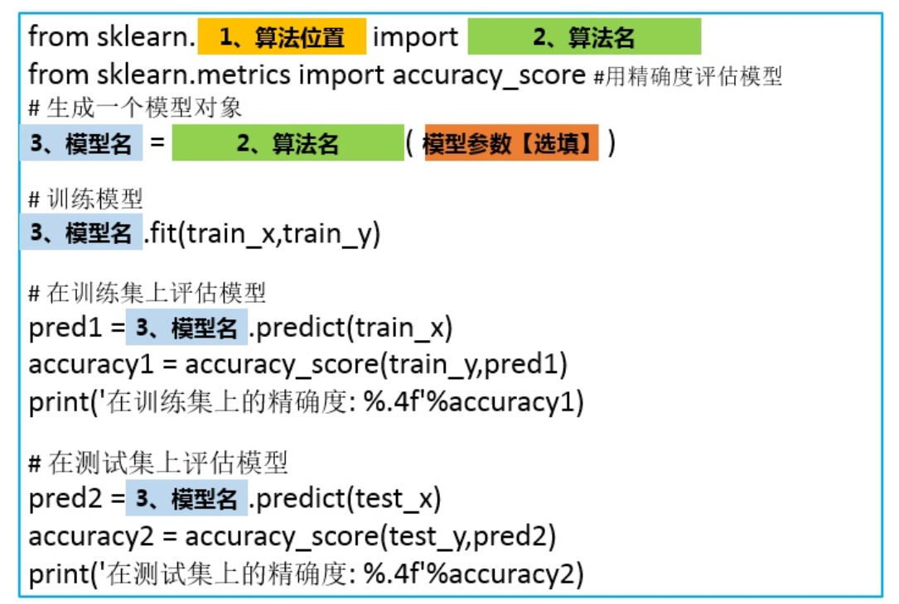
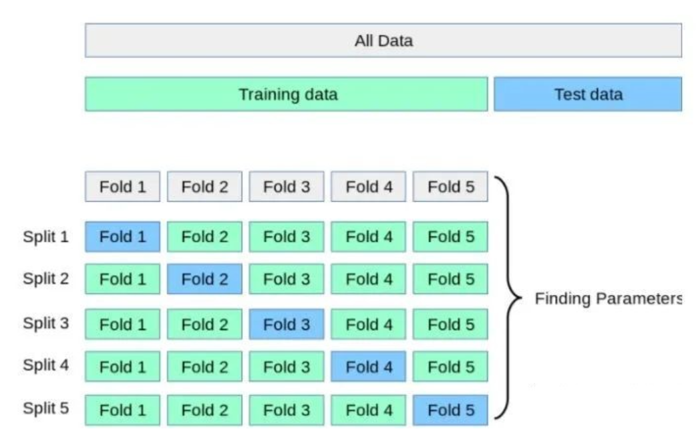
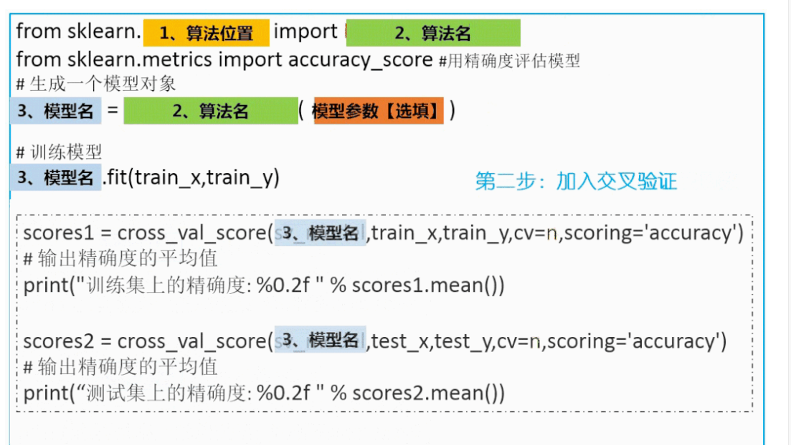
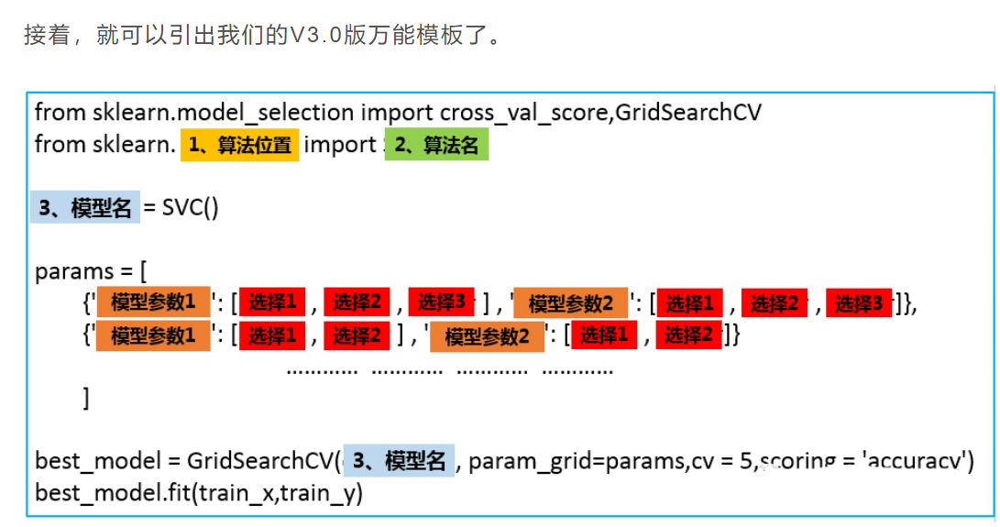

# data_eda
参考：https://icode.best/i/99230147034304

data_eda,model
常见的问题类型只有三种：分类、回归、聚类。而明确具体问题对应的类型也很简单。比如，如果你需要通过输入数据得到一个类别变量，那就是分类问题。分成两类就是二分类问题，分成两类以上就是多分类问题。常见的有：判别一个邮件是否是垃圾邮件、根据图片分辩图片里的是猫还是狗等等。

如果你需要通过输入数据得到一个具体的连续数值，那就是回归问题。比如：预测某个区域的房价等。

常用的分类和回归算法算法有：SVM (支持向量机) 、xgboost、, KNN、LR算法、SGD (随机梯度下降算法)、Bayes (贝叶斯估计)以及随机森林等。这些算法大多都既可以解分类问题，又可以解回归问题。

如果你的数据集并没有对应的属性标签，你要做的，是发掘这组样本在空间的分布, 比如分析哪些样本靠的更近，哪些样本之间离得很远, 这就是属于聚类问题。常用的聚类算法有k-means算法。

在本文中，我们主要解决第二步：通过skicit-learn构建模型。
## 万能模板V1.0版

## 万能模板V2.0版

加入交叉验证，让算法模型评估更加科学
在1.0版的模板中，当你多次运行同一个程序就会发现：每次运行得到的精确度并不相同，而是在一定范围内浮动，这是因为数据输入模型之前会进行选择，每次训练时数据输入模型的顺序都不一样。所以即使是同一个程序，模型最后的表现也会有好有坏。

更糟糕的是，有些情况下，在训练集上，通过调整参数设置使模型的性能达到了最佳状态，但在测试集上却可能出现过拟合的情况。这个时候，我们在训练集上得到的评分不能有效反映出模型的泛化性能。

为了解决上述两个问题，还应该在训练集上划分出验证集(validation set)并结合交叉验证来解决。首先，在训练集中划分出不参与训练的验证集，只是在模型训练完成以后对模型进行评估，接着再在测试集上进行最后的评估。

但这样大大减少了可用于模型学习的样本数量，所以还需要采用交叉验证的方式多训练几次。比如说最常用的k-折交叉验证如下图所示，它主要是将训练集划分为 k 个较小的集合。然后将k-1份训练子集作为训练集训练模型，将剩余的 1 份训练集子集作为验证集用于模型验证。这样需要训练k次，最后在训练集上的评估得分取所有训练结果评估得分的平均值。

这样一方面可以让训练集的所有数据都参与训练，另一方面也通过多次计算得到了一个比较有代表性的得分。唯一的缺点就是计算代价很高，增加了k倍的计算量。

原理就是这样，但理想很丰满，现实很骨干。在自己实现的时候却有一个很大的难题摆在面前：怎么能够把训练集均匀地划分为K份？
 
这个问题不用思考太多，既然别忘了，我们现在是站在巨人的肩膀上，scikit-learn已经将优秀的数学家所想到的均匀拆分方法和程序员的智慧融合在了cross_val_score() 这个函数里了，只需要调用该函数即可，不需要自己想什么拆分算法，也不用写for循环进行循环训练。

万能模板2.0如下：

## 万能模板V3.0版
调参让算法表现更上一层楼
以上都是通过算法的默认参数来训练模型的，不同的数据集适用的参数难免会不一样，自己设计算法是设计不来的，只能调调参这样子，调参，是广大算法工程师最后的尊严。再说，若是做算法不调参，岂不是辱没了算法工程师在江湖上大名鼎鼎的“炼丹工程师”的名声？

scikit-learn对于不同的算法也提供了不同的参数可以自己调节。如果细说起来，又能写好几篇文章，本文目的是构建一个万能算法框架构建模板，所以，这里只介绍一下一个通用的自动化调参方法。

首先要明确的是，scikit-learn提供了算法().get_params()方法来查看每个算法可以调整的参数，比如说，我们想查看SVM分类器算法可以调整的参数，可以：

# to do
1. sklearn 实现分类、预测、聚类的三种问题的模板

    a. 数据处理

    b. 模型

    c. 评估

    d. 对新数据，预测/分类

建模：
https://zhuanlan.zhihu.com/p/160257154
数据：
https://cloud.tencent.com/developer/article/1787858

2. pytorch实现深度学习（非本周）